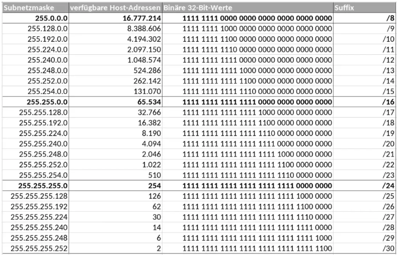

# 📘 Subnetting Notes (Easy Way)
```py
## 1. Required Host Numbers
60, 30, 2

### Formula (Easy Way)
IPv4 bits – 2^power table = /prefix value

### Example
- Required hosts: 60
- Nearest power of 2 ≥ 60 is 64
- 64 = 2⁶
- IPv4 total bits = 32

Calculation:
32 – 6 = /26


✅ Subnet mask = /26

## 2. Which IP to Use (Based on Number of Networks)
### Power Table for Network
2, 4, 8, 16, 32, 64, 128

### Formula (Easy Way)
- Required host networks: 60, 30, 2
- Total networks needed = 3
- Nearest power of 2 ≥ 3 is 4

Calculation:
60 × 4 = 240
```