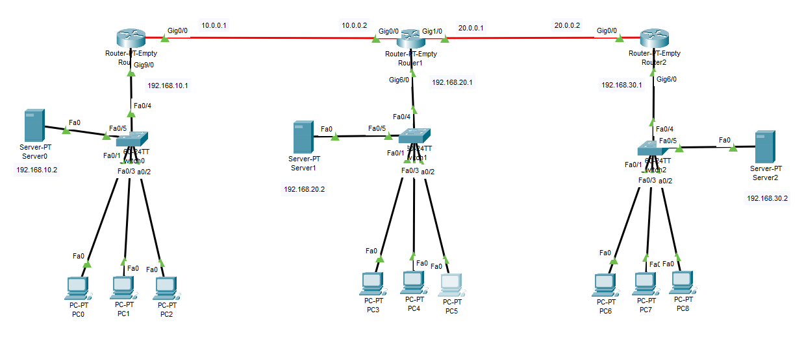

### ✅ RIP Configuration (Corrected)
> ⚠️ Best practice: always specify RIP version 2 and disable auto-summary



#### 🔹 R1 Configuration
```py
R1(config)# router rip
R1(config-router)# version 2
R1(config-router)# no auto-summary
R1(config-router)# network 10.0.0.0
R1(config-router)# network 192.168.10.0
```

#### 🔹 R2 Configuration
```py
R2(config)# router rip
R2(config-router)# version 2
R2(config-router)# no auto-summary
R2(config-router)# network 10.0.0.0
R2(config-router)# network 20.0.0.0
R2(config-router)# network 192.168.20.0
```

#### 🔹 R3 Configuration
```py
R3(config)# router rip
R3(config-router)# version 2
R3(config-router)# no auto-summary
R3(config-router)# network 20.0.0.0
R3(config-router)# network 192.168.30.0
```

#### ✅ Show Commands rip routing
```py
show ip route rip
```