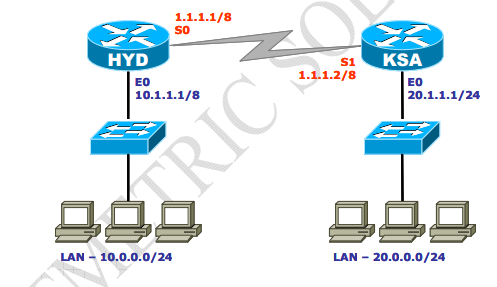
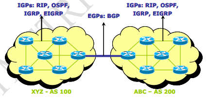

###


#### RIP Version 2
> • Classless routing protocol\
> • Supports VLSM\
> • Auto summary can be done on every router\
> • Supports authentication\
> • Trigger updates\
> • Uses multicast address 224.0.0.9

#### Advantages of RIP
> – Easy to configure\
> – No design constraints\
> – No complexity\
> – Less overhead

### Disadvantage of RIP
> – Bandwidth utilization is very high as broadcast for every 30 second\
> – Works only on hop count\
> – Not scalable as hop count is only 15\
> – Slow convergence 

#### Autonomous System Number
> · A unique number identifying the Routing domain of the routers.\
> · An autonomous system is a collection of networks under a common administrative domain\
> · Ranges from 1- 65535\
> · Public – `1 – 64512` Private – `64513 – 65535`
---



---


### Configuring RIP 2
```py
Router(config)# router rip
Router(config-router)# network <Network ID>
Router(config-router)# version 2 
```
### Configuration of RIP v2
#### [R1] On Hyderabad Router
```py
HYDERABAD # config t
HYDERABAD(config) # router rip
Router(config-router)# version 2 
HYDERABAD(config-router) # network 10.0.0.0
HYDERABAD(config-router) # network 1.0.0.0
HYDERABAD(config-router) # exit
HYDERABAD(config) # exit
```

##### [R2] On KSA Router
```py
KSA # config t
KSA(config) # router rip
Router(config-router)# version 2 
KSA(config-router) # network 20.0.0.0
KSA(config-router) # network 1.0.0.0
KSA(config-router) # exit
KSA(config) # exit
```

#### Routing Protocol Classification
---
| IGP (Interior Gateway Protocol) | EGP (Exterior Gateway Protocol) |
|---------------------------------|---------------------------------|
| Interior Gateway Protocol       | Exterior Gateway Protocol       |
| Used within an autonomous system (AS) | Used between different autonomous systems |
| All routers operate within the same AS boundary | Routers operate in different AS boundaries |
| Examples: RIP, IGRP, EIGRP, OSPF, IS-IS | Border Gateway Protocol (BGP) |
| Focuses on internal routing efficiency | Focuses on inter-domain routing |


> + – IGPs operate within an autonomous system
> + – EGPs connect different autonomous systems
---

