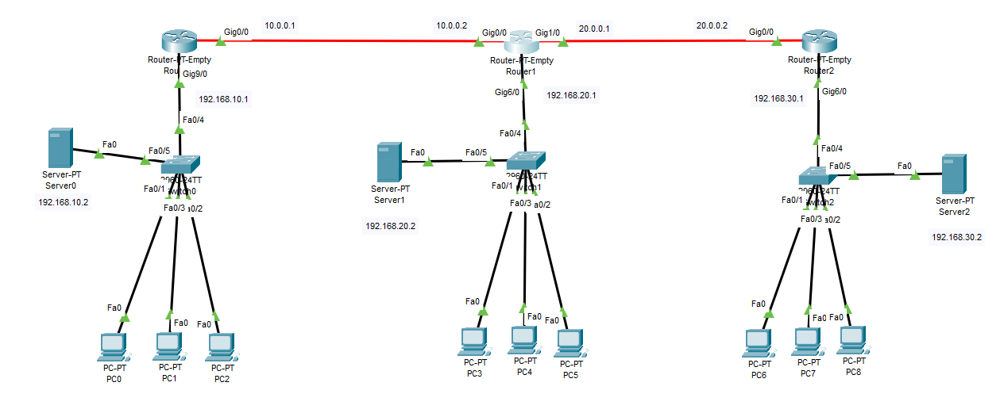

### Default Routes LAB
---


---

```py
### R1
ip route 0.0.0.0 0.0.0.0 10.0.0.2

### R2
ip route 0.0.0.0 0.0.0.0 10.0.0.1
ip route 0.0.0.0 0.0.0.0 20.0.0.2

### R3
ip route 0.0.0.0 0.0.0.0 20.0.0.1

## show only static routing
show ip route static

## Show routing table
show ip route
```