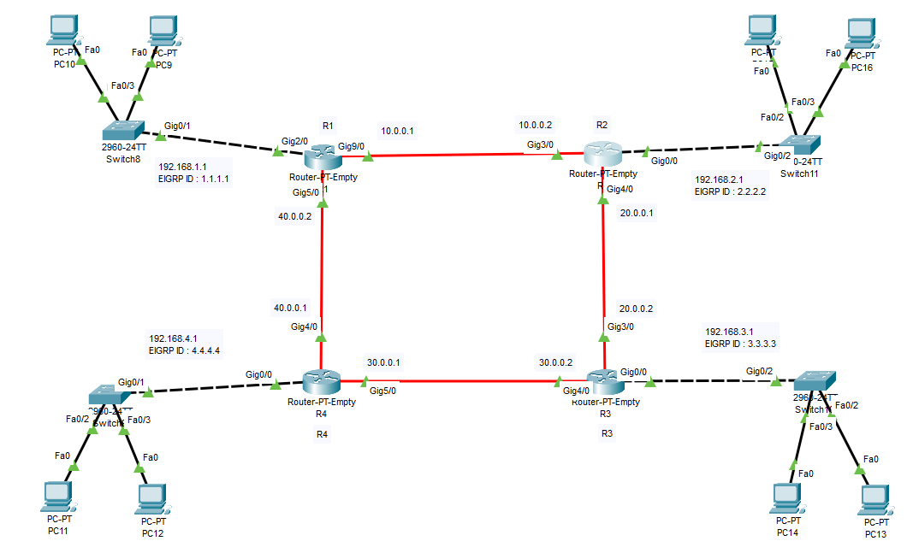

### 🔁 OSPF to EIGRP Routing Configuration (4-Router Topology)



### 🧩 Network Topology

> Router Positions
```py
| Router | Position |
|------|---------|
| R1 | Top-Left |
| R2 | Top-Right |
| R3 | Bottom-Right |
| R4 | Bottom-Left |
```
---

> 🌐 Router-to-Router Links
```py
| Link | Network |
|----|--------|
| R1 ↔ R2 | 10.0.0.0 /30 |
| R2 ↔ R3 | 20.0.0.0 /30 |
| R3 ↔ R4 | 30.0.0.0 /30 |
| R4 ↔ R1 | 40.0.0.0 /30 |
```
---

## 🖧 LAN Networks
```py
| Router | LAN Network |
|------|------------|
| R1 | 192.168.1.0 /24 |
| R2 | 192.168.2.0 /24 |
| R3 | 192.168.3.0 /24 |
| R4 | 192.168.4.0 /24 |
```
---

## 🔢 EIGRP Autonomous System
```py
All routers run **EIGRP AS 100**

| Router | EIGRP Router ID |
|------|----------------|
| R1 | 1.1.1.1 |
| R2 | 2.2.2.2 |
| R3 | 3.3.3.3 |
| R4 | 4.4.4.4 |
```
---

## 🚀 EIGRP Configuration

> R1
```py
R1(config)# router eigrp 100                 # Start EIGRP process (AS 100)
R1(config-router)# eigrp router-id 1.1.1.1   # Set router ID
R1(config-router)# no auto-summary           # Disable auto summarization
R1(config-router)# network 10.0.0.0 0.0.0.3  # R1–R2 link
R1(config-router)# network 40.0.0.0 0.0.0.3  # R1–R4 link
R1(config-router)# network 192.168.1.0 0.0.0.255  # LAN network


 ```
> 🔹 R2
```py

R2(config)# router eigrp 100                 # Start EIGRP process (AS 100)
R2(config-router)# eigrp router-id 2.2.2.2   # Set router ID
R2(config-router)# no auto-summary           # Disable auto summarization
R2(config-router)# network 10.0.0.0 0.0.0.3  # R2–R1 link
R2(config-router)# network 20.0.0.0 0.0.0.3  # R2–R3 link
R2(config-router)# network 192.168.2.0 0.0.0.255  # LAN network

 ```
> 🔹 R3
```py
R3(config)# router eigrp 100                 # Start EIGRP process (AS 100)
R3(config-router)# eigrp router-id 3.3.3.3   # Set router ID
R3(config-router)# no auto-summary           # Disable auto summarization
R3(config-router)# network 20.0.0.0 0.0.0.3  # R3–R2 link
R3(config-router)# network 30.0.0.0 0.0.0.3  # R3–R4 link
R3(config-router)# network 192.168.3.0 0.0.0.255  # LAN network

```
> 🔹 R4
```py
R4(config)# router eigrp 100                 # Start EIGRP process (AS 100)
R4(config-router)# eigrp router-id 4.4.4.4   # Set router ID
R4(config-router)# no auto-summary           # Disable auto summarization
R4(config-router)# network 30.0.0.0 0.0.0.3  # R4–R3 link
R4(config-router)# network 40.0.0.0 0.0.0.3  # R4–R1 link
R4(config-router)# network 192.168.4.0 0.0.0.255  # LAN network

```

### 🔍 Verification Commands
```py
show ip eigrp neighbors
show ip eigrp topology
show ip route eigrp
```