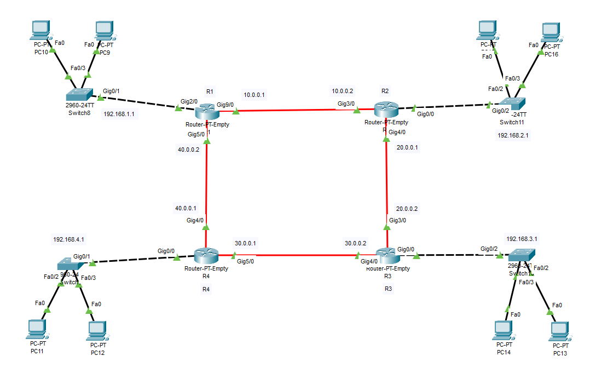

### OSPF ROUTING
```py
R1 – Top-Left        # Router 1 position in topology
R2 – Top-Right       # Router 2 position in topology
R3 – Bottom-Right    # Router 3 position in topology
R4 – Bottom-Left     # Router 4 position in topology

> OSPF
# Process ID: 1      # Local OSPF process number (only local significance)
# Area: 0            # Backbone area (mandatory in OSPF)
```

>  🌐 Router-to-Router Links
```py
### Link        Network
R1 ↔ R2        10.0.12.0 /30    # Point-to-point link between R1 and R2
R2 ↔ R3        10.0.23.0 /30    # Point-to-point link between R2 and R3
R3 ↔ R4        10.0.34.0 /30    # Point-to-point link between R3 and R4
R4 ↔ R1        10.0.41.0 /30    # Point-to-point link between R4 and R1
```
>  🖧 LAN Networks
```py
Router   LAN Network
R1       192.168.1.0 /24   # LAN connected to Router R1
R2       192.168.2.0 /24   # LAN connected to Router R2
R3       192.168.3.0 /24   # LAN connected to Router R3
R4       192.168.4.0 /24   # LAN connected to Router R4
```

---


---

--- 
## ⚙️ INTERFACE CONFIGURATION (WITH COMMENTS)
> R1 Configuration
```py
interface g2/0
 ip address 192.168.1.1 255.255.255.0   # Assign LAN IP to R1
 no shutdown                            # Enable the interface

interface g9/0
 ip address 10.0.0.1 255.0.0.0   # Link IP between R1 and R2
 no shutdown                            # Enable the interface

interface g5/0
 ip address 40.0.0.2 255.0.0.0   # Link IP between R1 and R4
 no shutdown                            # Enable the interface
```


>  R2 Configuration
```py
interface g0/0
 ip address 192.168.2.1 255.255.255.0   # Assign LAN IP to R2
 no shutdown                            # Enable the interface

interface g3/0
 ip address 10.0.0.2 255.0.0.0   # Link IP between R2 and R1
 no shutdown                            # Enable the interface

interface g3/0
 ip address 20.0.0.1 255.0.0.0   # Link IP between R2 and R3
 no shutdown                            # Enable the interface
```


>  R3 Configuration
```py
interface g0/0
 ip address 192.168.3.1 255.255.255.0   # Assign LAN IP to R3
 no shutdown                            # Enable the interface

interface g3/0
 ip address 20.0.0.2 255.0.0.0   # Link IP between R3 and R2
 no shutdown                            # Enable the interface

interface g4/0
 ip address 30.0.0.2 255.0.0.0   # Link IP between R3 and R4
 no shutdown                            # Enable the interface
 ```


> R4 Configuration
```py
interface g0/0
 ip address 192.168.4.1 255.255.255.0   # Assign LAN IP to R4
 no shutdown                            # Enable the interface

interface g0/1
 ip address 40.0.0.1 255.0.0.0   # Link IP between R4 and R3
 no shutdown                            # Enable the interface

interface g5/0
 ip address 30.0.0.1 255.0.0.0   # Link IP between R4 and R1
 no shutdown                            # Enable the interface
```


## 🚀 OSPF CONFIGURATION (WITH COMMENTS)
### 🔹 R1 – OSPF
```py
router ospf 1                           # Start OSPF process ID 1
 router-id 1.1.1.1                     # Manually set Router ID
 network 192.168.1.0 0.0.0.255 area 0  # Advertise R1 LAN into OSPF area 0
 network 10.0.0.0 0.0.0.3 area 0      # Advertise R1–R2 link
 network 40.0.0.0 0.0.0.3 area 0      # Advertise R1–R4 link
```

### 🔹 R2 – OSPF
```py
router ospf 1                           # Start OSPF process
 router-id 2.2.2.2                     # Unique Router ID
 network 192.168.2.0 0.0.0.255 area 0  # Advertise R2 LAN
 network 10.0.0.0 0.0.0.3 area 0      # Advertise R2–R1 link
 network 20.0.0.0 0.0.0.3 area 0      # Advertise R2–R3 link
```

### 🔹 R3 – OSPF
```py
 router ospf 1                        # Unique Router ID
 router-id 3.3.3.3                    # Unique Router ID
 network 192.168.3.0 0.0.0.255 area 0 # Advertise R3 LAN
 network 20.0.0.0 0.0.0.3 area 0      # Advertise R3–R2 link
 network 30.0.0.0 0.0.0.3 area 0      # Advertise R3–R4 link
```

### 🔹 R4 – OSPF
```py
router ospf 1                          # Start OSPF process
 router-id 4.4.4.4                     # Unique Router ID
 network 192.168.4.0 0.0.0.255 area 0  # Advertise R4 LAN
 network 30.0.0.0 0.0.0.3 area 0       # Advertise R4–R3 link
 network 40.0.0.0 0.0.0.3 area 0       # Advertise R4–R1 link
```

### ADD OSPF (Enable / Add Networks)
```py
Start OSPF on a Router
router ospf 1                 # Create OSPF process ID 1 (or enter if exists)

### Add a New Network into OSPF
router ospf 1
 network 192.168.5.0 0.0.0.255 area 0
# Advertises new LAN network into OSPF area 0

### Add OSPF on a Specific Interface (Best Practice)
interface g0/1
 ip ospf 1 area 0
# Enables OSPF only on this interface

### Add Router ID
router ospf 1
 router-id 5.5.5.5
# Manually sets OSPF Router ID (requires OSPF restart)
```
### 🔻 REMOVE OSPF (Delete / Disable)
```py
### Remove a Network from OSPF
router ospf 1
 no network 192.168.5.0 0.0.0.255 area 0
# Stops advertising this network in OSPF

### Remove OSPF from an Interface
interface g0/1
 no ip ospf 1 area 0
# Disables OSPF on this interface only

### Remove Router ID
router ospf 1
 no router-id
# Removes manually configured Router ID

### Remove Entire OSPF Process (⚠ Dangerous)
no router ospf 1
# Deletes OSPF completely from the router
```
### 🔁 MODIFY OSPF (Common Changes)
```py
### Change OSPF Area
router ospf 1
 no network 10.0.12.0 0.0.0.3 area 0
 network 10.0.12.0 0.0.0.3 area 1
# Moves network from area 0 to area 1

### Change OSPF Cost
interface g0/1
 ip ospf cost 50
# Manually sets OSPF cost for path selection

### Make Interface Passive (No Hellos)
router ospf 1
 passive-interface g0/0
# Stops OSPF neighbor formation on LAN interface

### Remove Passive Interface
router ospf 1
 no passive-interface g0/0
# Allows OSPF neighbors again
```
### 🔍 VERIFICATION COMMANDS
```py
show ip ospf
# Shows OSPF process details

show ip ospf interface
# Shows OSPF-enabled interfaces

show ip route ospf
# Displays OSPF learned routes

clear ip ospf process
# Restarts OSPF process (use carefully)
```
## ResQ
https://networklessons.com/ospf/basic-ospf-configuration