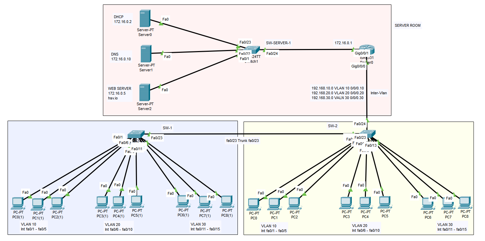

### Inter-VLAN Routing Using Router (Router-on-a-Stick)
---



---

#### 🔹 Step 1: Configure Trunk on Switch
```py
Switch(config)# interface fa0/24
Switch(config-if)# switchport mode trunk
Switch(config-if)# exit
```

#### 🔹 Step 2: Create Sub-Interfaces on Router
```py
Router> enable
Router# configure terminal

# VLAN 10
Router(config)# interface fa0/0.10
Router(config-subif)# encapsulation dot1Q 10
Router(config-subif)# ip address 192.168.10.1 255.255.255.0
Router(config-subif)# exit

# VLAN 20
Router(config)# interface fa0/0.20
Router(config-subif)# encapsulation dot1Q 20
Router(config-subif)# ip address 192.168.20.1 255.255.255.0
Router(config-subif)# exit

# VLAN 30
Router(config)# interface fa0/0.30
Router(config-subif)# encapsulation dot1Q 30
Router(config-subif)# ip address 192.168.30.1 255.255.255.0
Router(config-subif)# exit
```
#### 🔍 Verification (Router)
```py
Router# show ip interface brief
Router# show running-config
```
#### 🆚 Layer 3 Switch vs Router-on-a-Stick
| Feature          | L3 Switch      | Router        |
| ---------------- | -------------- | ------------- |
| Routing Speed    | Very Fast      | Slower        |
| Method           | SVI            | Sub-interface |
| Bottleneck       | ❌ No           | ✅ Yes         |
| Best For         | Enterprise LAN | Small Network |
| Hardware Routing | Yes            | No            |

## ✅ Important Exam Notes
- VLAN must exist before creating SVI
- ip routing is mandatory on L3 switch
- PCs use SVI / Router IP as Default Gateway
- Trunk required for router-based routing