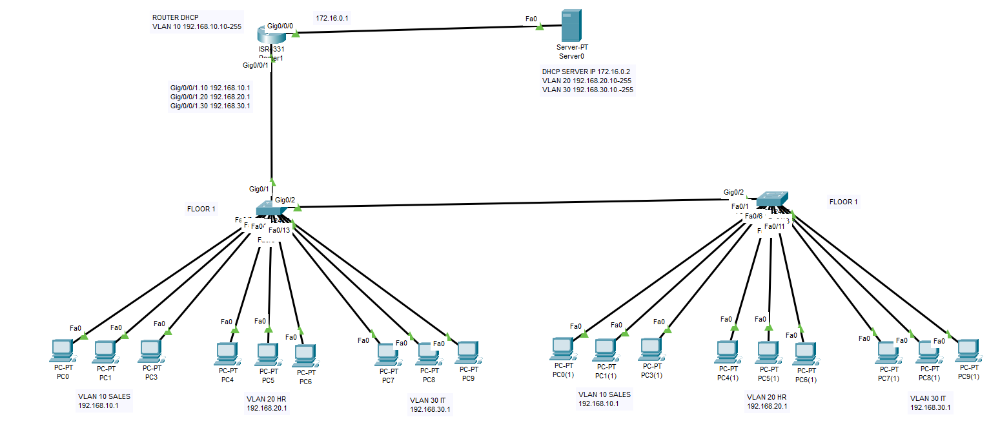

---



----
### 🧭 STEP 1: L2 SWITCH CONFIGURATION
+ 🔹 Create VLANs

```py
Switch> enable
Switch# configure terminal

Switch(config)# vlan 10
Switch(config-vlan)# name SALES
Switch(config-vlan)# exit

Switch(config)# vlan 20
Switch(config-vlan)# name HR
Switch(config-vlan)# exit

Switch(config)# vlan 30
Switch(config-vlan)# name IT
Switch(config-vlan)# exit
```
🔹 Assign Access Ports
```py
Switch(config)# interface range f0/1-5
Switch(config-if-range)# switchport mode access
Switch(config-if-range)# switchport access vlan 10
Switch(config-if-range)# exit

Switch(config)# interface range f0/6-10
Switch(config-if-range)# switchport mode access
Switch(config-if-range)# switchport access vlan 20
Switch(config-if-range)# exit

Switch(config)# interface range f0/11-15
Switch(config-if-range)# switchport mode access
Switch(config-if-range)# switchport access vlan 30
Switch(config-if-range)# exit
```
🔹 Configure Trunk Port (to Router)

```py
Switch(config)# interface f0/24
Switch(config-if)# switchport mode trunk
Switch(config-if)# no shutdown
```

### 🧭 STEP 2: ROUTER CONFIGURATION (INTER-VLAN)

🔹 Create Sub-Interfaces
```py
Router> enable
Router# configure terminal

Router(config)# interface g0/0
Router(config-if)# no shutdown
Router(config-if)# exit
```
🔹 VLAN 10
```py
Router(config)# interface g0/0.10
Router(config-if)# encapsulation dot1Q 10
Router(config-if)# ip address 192.168.10.1 255.255.255.0
# Optional If HAve DHCP SERVER
Router(config-subif)#ip helper-address 172.168.0.2
Router(config-if)# exit
```
🔹 VLAN 20
```py
Router(config)# interface g0/0.20
Router(config-if)# encapsulation dot1Q 20
Router(config-if)# ip address 192.168.20.1 255.255.255.0
# Optional If HAve DHCP SERVER
Router(config-subif)#ip helper-address 172.168.0.2
Router(config-if)# exit
```
🔹 VLAN 30
```py
Router(config)# interface g0/0.30
Router(config-if)# encapsulation dot1Q 30
Router(config-if)# ip address 192.168.30.1 255.255.255.0
# Optional If HAve DHCP SERVER
Router(config-subif)#ip helper-address 172.168.0.2
Router(config-if)# exit
```

### 🧭 STEP 3: DHCP CONFIGURATION (ON ROUTER)
🔹 Exclude Gateway IPs
```py
Router(config)# ip dhcp excluded-address 192.168.10.1
Router(config)# ip dhcp excluded-address 192.168.20.1
Router(config)# ip dhcp excluded-address 192.168.30.1
```
🔹 DHCP Pool for VLAN 10
```py
Router(config)# ip dhcp pool VLAN10
Router(dhcp-config)# network 192.168.10.0 255.255.255.0
Router(dhcp-config)# default-router 192.168.10.1
Router(dhcp-config)# dns-server 8.8.8.8
Router(dhcp-config)# exit
```
🔹 DHCP Pool for VLAN 20
```py
Router(config)# ip dhcp pool VLAN20
Router(dhcp-config)# network 192.168.20.0 255.255.255.0
Router(dhcp-config)# default-router 192.168.20.1
Router(dhcp-config)# dns-server 8.8.8.8
Router(dhcp-config)# exit
```
🔹 DHCP Pool for VLAN 30
```py
Router(config)# ip dhcp pool VLAN30
Router(dhcp-config)# network 192.168.30.0 255.255.255.0
Router(dhcp-config)# default-router 192.168.30.1
Router(dhcp-config)# dns-server 8.8.8.8
Router(dhcp-config)# exit
```
✅ FINAL CHECK COMMANDS
> Switch
```py
show vlan brief
show interfaces trunk
```
> Router
```py
show ip interface brief
show ip dhcp binding
```