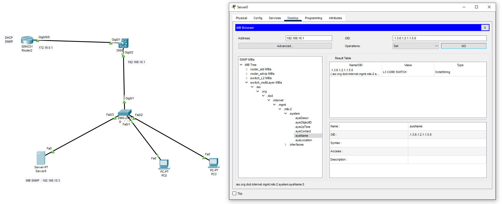

### Cisco L3 Network Configuration (Router + Multilayer Switch + Access Switch)

> This project demonstrates a **working Layer-3 network design** using a Cisco Router, Multilayer Switch, and Access Switch.  

> The router provides **DHCP**, the multilayer switch performs **inter-VLAN routing**, and end devices receive IP addresses automatically.



---

### 📌 Network Topology Overview

```py
- **Router (ISR4331)**
  - Interface IP: `172.16.0.1/30`
  - Provides DHCP for LAN
- **Multilayer Switch (3560)**
  - Gateway (SVI): `192.168.10.1/24`
  - Handles Layer-3 routing
- **Access Switch (2960)**
  - Layer-2 only
- **LAN Network**
  - `192.168.10.0/24`
- **PCs**
  - Receive IP via DHCP
```

### 🔹 1️⃣ Router (ISR4331) Configuration

### Interface Configuration
```py
enable
configure terminal


# Config Ip
interface gigabitEthernet0/0/0
 ip address 172.16.0.1 255.255.255.252
 no shutdown
exit
```
> DHCP Configuration
```py
ip dhcp excluded-address 192.168.10.1 192.168.10.10

ip dhcp pool LAN10
 network 192.168.10.0 255.255.255.0
 default-router 192.168.10.1
 dns-server 8.8.8.8
exit
```
> set snmp
```py
snmp-server community read RO
snmp-server community write RW
```

> Static Route to LAN
```py
ip route 192.168.10.0 255.255.255.0 172.16.0.2
```

### 🔹 2️⃣ Multilayer Switch (3560) Configuration
> Enable Layer-3 Routing
```py
enable
configure terminal
ip routing
```
> Interface to Router (L3 Port)
```py
interface gigabitEthernet0/1
 no switchport
 ip address 172.16.0.2 255.255.255.252
 no shutdown
exit
```
> set snmp
```py
snmp-server community read RO
snmp-server community write RW
```
```
> Interface to Access Switch (Trunk)
```py
interface gigabitEthernet0/2
 switchport mode trunk
 no shutdown
exit
```
> VLAN and SVI Configuration
```py
vlan 10
 name USERS
exit

interface vlan 10
 ip address 192.168.10.1 255.255.255.0
 ip helper-address 172.16.0.1
 no shutdown
exit
```
> Default Route to Router
```py
ip route 0.0.0.0 0.0.0.0 172.16.0.1
```
### 🔹 3️⃣ Access Switch (2960) Configuration
> Trunk to Multilayer Switch
```py
enable
configure terminal

interface gigabitEthernet0/1
 switchport mode trunk
 no shutdown
exit
```
> Access Ports for PCs
```py
interface range fastEthernet0/1 - 3
 switchport mode access
 switchport access vlan 10
 no shutdown
exit
```
### MIB SERVER
```py
IP : 192.168.10.3
```


### 🔹 4️⃣ PCs Configuration
```py
Set IP Configuration → DHCP

Assigned automatically:


IP Address : 192.168.10.x
Gateway    : 192.168.10.1
DNS        : 8.8.8.8
```
> ✅ Verification Commands
> Use the following commands to verify connectivity and configuration:

```py
show ip route
show ip dhcp binding
show vlan brief
ping 192.168.10.1
ping 172.16.0.1
```