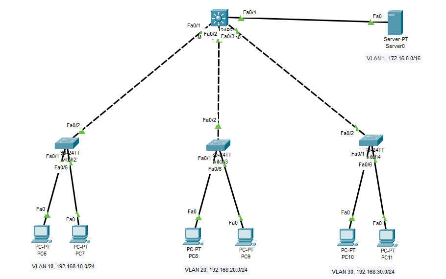

### DHCP & 3 VLAN



# ++++++++++++ SW 1 ++++++++++++++++
```py
Switch>en
Switch#configure t
Switch(config)#hostname SW-1
SW-1(config)#interface range fastEthernet 0/1-5
SW-1(config-if-range)#switchport access vlan 10


en
configure t
hostname SW-1
interface range fastEthernet 0/1-5
switchport access vlan 10

```

# ++++++++++++ SW 2 ++++++++++++++++
```py
en
configure t
hostname SW-1
interface range fastEthernet 0/1-5
switchport access vlan 20
```

# ++++++++++++ SW 3 ++++++++++++++++
```py
en
configure t
hostname SW-3
interface range fastEthernet 0/1-5
switchport access vlan 30
```
# ++++++++++++ SW L3 ++++++++++++++++
```py
## vlan access & ip assing vlan in ip address
# VLAN 10
interface fastEthernet 0/1
switchport  VLAmode access
switchport access vlan 10

interface vlan 10
ip address 192.168.10.1 255.255.255.0

## vlan access & ip assing vlan in ip address
# VLAN 20
interface fastEthernet 0/2
switchport mode access
switchport access vlan 20

interface vlan 20
ip address 192.168.20.1 255.255.255.0

## vlan access & ip assing vlan in ip address
# VLAN 30
interface fastEthernet 0/3
switchport mode access
switchport access vlan 30

interface vlan 30
ip address 192.168.30.1 255.255.255.0


# DHCP helper
CORE-SW-1(config)#interface vlan 10
CORE-SW-1(config-if)#ip helper-address 172.168.0.2


## vlan 10
interface vlan 10
ip helper-address 172.16.0.2

## vlan 20
interface vlan 20
ip helper-address 172.16.0.2

## vlan 30
interface vlan 30
ip helper-address 172.16.0.2

#### Route
CORE-SW-1(config)#ip routing

#### assing Vlan ip 
int vlan 1
ip address 172.16.0.1 255.255.0.0

```


