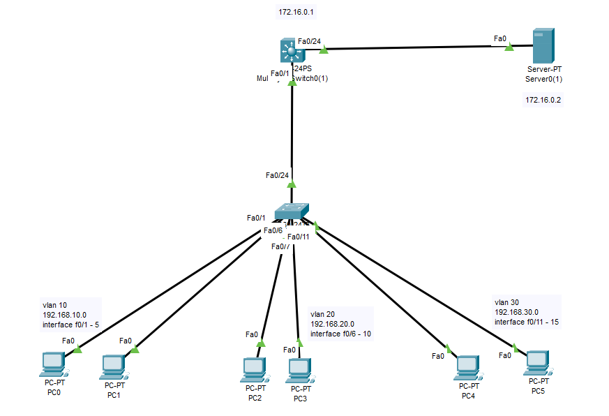

### Vlan Network & DHCP



### ---------------- L2 SWITCH -------------------------

```py
vlan 10
 name VLAN10
exit

vlan 20
 name VLAN20
exit

vlan 30
 name VLAN30
exit

interface range fa0/1 - 5
 switchport mode access
 switchport access vlan 10
exit

interface range fa0/6 - 10
 switchport mode access
 switchport access vlan 20
exit

interface range fa0/11 - 15
 switchport mode access
 switchport access vlan 30
exit

interface fa0/24
 switchport mode trunk
 switchport trunk allowed vlan 10,20,30
exit
```

### ----------------L3 CORE SWITCH -------------------------
```py
ip routing

vlan 10
 name VLAN10
exit

vlan 20
 name VLAN20
exit

vlan 30
 name VLAN30
exit

interface vlan 10
 ip address 192.168.10.1 255.255.255.0
 no shutdown
exit

interface vlan 20
 ip address 192.168.20.1 255.255.255.0
 no shutdown
exit

interface vlan 30
 ip address 192.168.30.1 255.255.255.0
 no shutdown
exit

interface fa0/1
 switchport mode trunk
 switchport trunk allowed vlan 10,20,30
exit

ip address 172.16.0.1 255.255.0.0

int vlan 10 
ip helper-address 172.16.0.2
no sh

int vlan 20
ip helper-address 172.16.0.2
no sh

int vlan 30
ip helper-address 172.16.0.2
no sh

end
write memory

```


