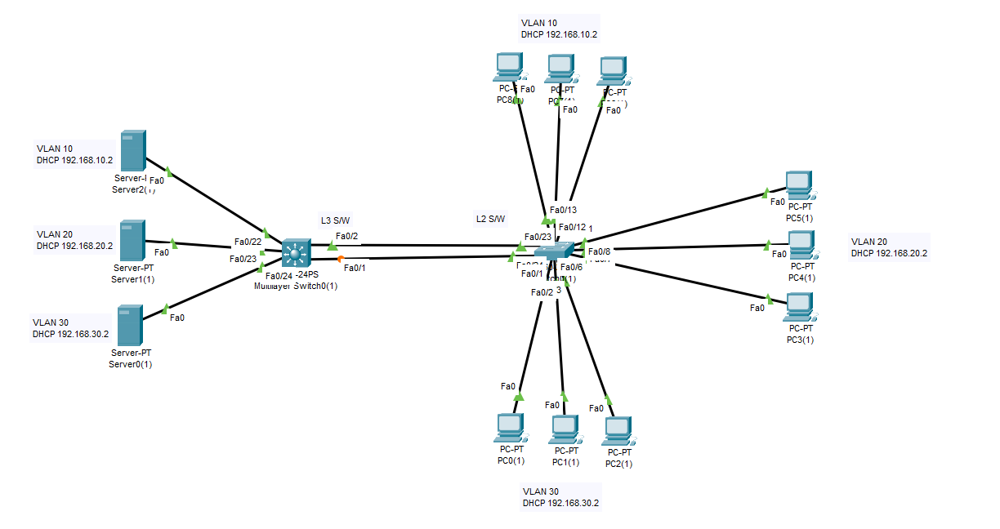

### 3 DHCP SERVER & L3 CORE SIWTCH & L2 SIWTCH



<a href="L3&3DHCP.pkt">Click File</a>

### L3 SWITCH CONFIG 
```py
enable
configure terminal
ip routing


vlan 10
 name VLAN10
vlan 20
 name VLAN20
vlan 30
 name VLAN30
exit


interface vlan 10
 ip address 192.168.10.1 255.255.255.0
 ip helper-address 192.168.10.2
 no shutdown

interface vlan 20
 ip address 192.168.20.1 255.255.255.0
 ip helper-address 192.168.20.2
 no shutdown

interface vlan 30
 ip address 192.168.30.1 255.255.255.0
 ip helper-address 192.168.30.2
 no shutdown

interface fa0/1
 switchport trunk encapsulation dot1q
 switchport mode trunk
 switchport trunk allowed vlan 10,20,30
 no shutdown

interface fa0/22
 switchport mode access
 switchport access vlan 10

interface fa0/23
 switchport mode access
 switchport access vlan 20

interface fa0/24
 switchport mode access
 switchport access vlan 30
```
### LAYER-2 SWITCH (2960) CONFIG
```py
enable
configure terminal

vlan 10
vlan 20
vlan 30
exit

interface fa0/24
 switchport mode trunk
 switchport trunk allowed vlan 10,20,30
 no shutdown

! VLAN 10
interface range fa0/1 - 5
 switchport mode access
 switchport access vlan 10

! VLAN 20
interface range fa0/6 - 10
 switchport mode access
 switchport access vlan 20

! VLAN 30
interface range fa0/11 - 15
 switchport mode access
 switchport access vlan 30

```